### To run this, download [Anaconda](https://www.anaconda.com/products/individual)

### Import the libraries
If any are missing install using *pip3 install ...*


```python
import pandas as pd
import matplotlib.pyplot as plt
import matplotlib.ticker as ticker
import seaborn as sns
import numpy as np
```

### Configure inline charts


```python
%matplotlib inline
plt.rcParams["figure.figsize"] = (20,3)
```

### Read the data


```python
data = pd.read_csv('../../DATA/DuomenuMasyvasCSV.csv')
```

### List the columns


```python
list(data.columns)
```


    ['ID',
     'MMR reg metai',
     'PVM reg metai',
     'Statusas',
     'Mokejimai 2019m 01men',
     'Mokejimai 2019m 02men',
     'Mokejimai 2019m 03men',
     'Mokejimai 2019m 04men',
     'Mokejimai 2019m 05men',
     'Mokejimai 2019m 06men',
     'Mokejimai 2019m 07men',
     'Mokejimai 2019m 08men',
     'Mokejimai 2019m 09men',
     'Mokejimai 2019m 10men',
     'Mokejimai 2019m 11men',
     'Mokejimai 2019m 12men',
     'Mokėjimai 2019m',
     'Mokejimai 2020m 01men',
     'Mokejimai 2020m 02men',
     'Mokejimai 2020m 03men',
     'Mokejimai 2020m 04men',
     'PVMD Apyvarta 2019m 01mėn',
     'PVM Prievolė 2019m 01mėn',
     'PVMD Apyvarta 2019m 02mėn',
     'PVM Prievolė 2019m 02mėn',
     'PVMD Apyvarta 2019m 03mėn',
     'PVM Prievolė 2019m 03mėn',
     'PVMD Apyvarta 2019m 04mėn',
     'PVM Prievolė 2019m 04mėn',
     'PVMD Apyvarta 2019m 05mėn',
     'PVM Prievolė 2019m 05mėn',
     'PVMD Apyvarta 2019m 06mėn',
     'PVM Prievolė 2019m 06mėn',
     'PVMD Apyvarta 2019m 07mėn',
     'PVM Prievolė 2019m 07mėn',
     'PVMD Apyvarta 2019m 08mėn',
     'PVM Prievolė 2019m 08mėn',
     'PVMD Apyvarta 2019m 09mėn',
     'PVM Prievolė 2019m 09mėn',
     'PVMD Apyvarta 2019m 10mėn',
     'PVM Prievolė 2019m 10mėn',
     'PVMD Apyvarta 2019m 11mėn',
     'PVM Prievolė 2019m 11mėn',
     'PVMD Apyvarta 2019m 12mėn',
     'PVM Prievolė 2019m 12mėn',
     'PVMD Apyvarta 2019m',
     'PVM Prievolė 2019m',
     'PVMD Apyvarta 2020m 01mėn',
     'PVM Prievolė 2020m 01mėn',
     'PVMD Apyvarta 2020m 02mėn',
     'PVM Prievolė 2020m 02mėn',
     'PVMD Apyvarta 2020m 03mėn',
     'PVM Prievolė 2020m 03mėn',
     'Darbuotojai 20200301',
     'Darbuotojai 20200401',
     'Darbo apmokėjimo suma 2019m',
     'EV kodas',
     'EV pavadinimas',
     'EV skyrius',
     'EV sekcija',
     'EV skyriaus kodas',
     'EV sekcijos kodas']


### What types of Statusas do we have?


```python
data.groupby('Statusas').size()
```


    Statusas
    0. Teisinis statusas neįregistruotas                                              72195
    1. Reorganizuojamas                                                                  42
    2. Dalyvaujantis reorganizavime                                                      29
    23. Jungiamas peržengiant vienos valstybės ribas juridinis asmuo                      2
    24. Dalyvaujantis jungimesi peržengiant vienos valstybės ribas juridinis asmuo        1
    3. Pertvarkomas                                                                      71
    4. Restruktūrizuojamas                                                               82
    5. Bankrutuojantis                                                                  274
    6. Bankrutavęs                                                                      324
    7. Likviduojamas                                                                    151
    8. Dalyvaujantis atskyrime                                                           23
    999. Nenustatytas                                                                    87
    dtype: int64


### Filter to only active companies


```python
data_active = data[data['Statusas'].eq('0. Teisinis statusas neįregistruotas')]
```


```python
data_active['ID'].size
```


    72195


### We are down to 72195 companies - this is our universe

### Lets make a quick summary of the data; make sure we have no false assumptions or expectations

### All IDs are unique - perfect


```python
data_active['ID'].unique().size
```


    72195


### Lets look at company registration dates


```python
cols = ['MMR reg metai', 'PVM reg metai']
for col in cols:
    data_active[col].value_counts().plot(kind='bar', title=col)
    plt.show()
```


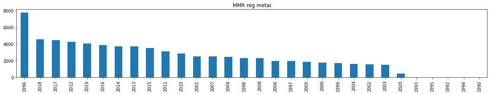


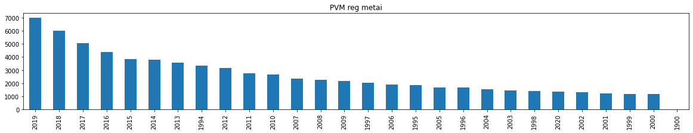


### *Question*: What happened to MMR register in 1996?

## Industry sectors


```python
cols =  ['EV skyrius',
         'EV sekcija']

```


```python
for col in cols:
    data_active[col].value_counts().plot(kind='bar', title=col)
    #plt.yscale('log')
    plt.show()
```


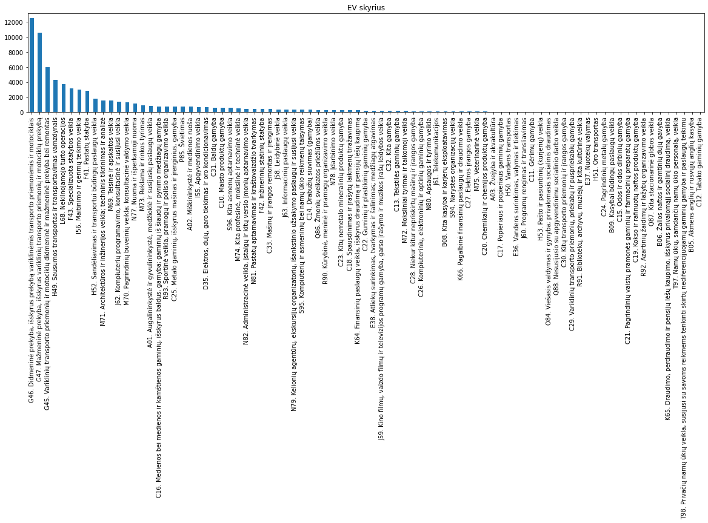


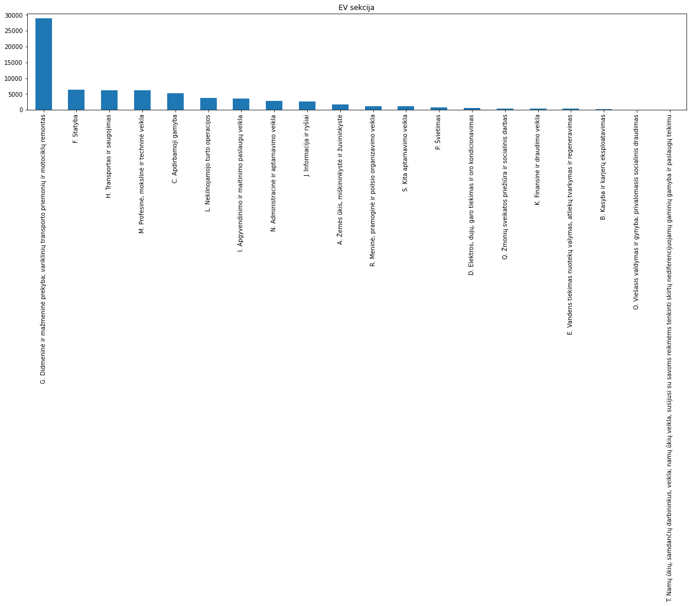


## Wholesale + Retail = 40% of companies in the register


```python
"{:.0%}".format( data_active.groupby('EV sekcija').size().sort_values(ascending=False)[0] / data_active['ID'].size )
```


    '40%'


## Retail + Wholesale = 46% of all revenue


```python
"{:,.0%}".format( data_active.groupby('EV sekcija')['PVMD Apyvarta 2019m'].agg('sum').sort_values(ascending=False)[0] / data_active['PVMD Apyvarta 2019m'].sum() )
```


    '46%'


```python
for col in cols:
    data_active.groupby([col])['PVMD Apyvarta 2019m'].agg('sum').sort_values(ascending=False).plot(kind='bar', title=col)
    plt.xlabel(col)
    #plt.yscale('log')
    plt.show()
```


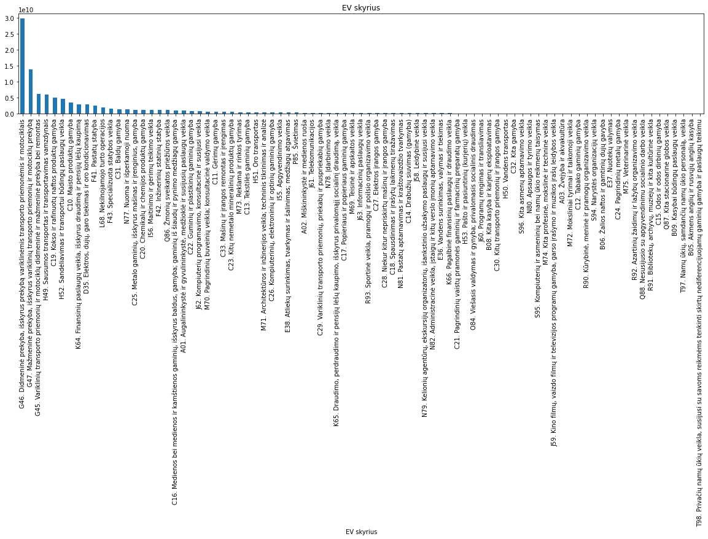


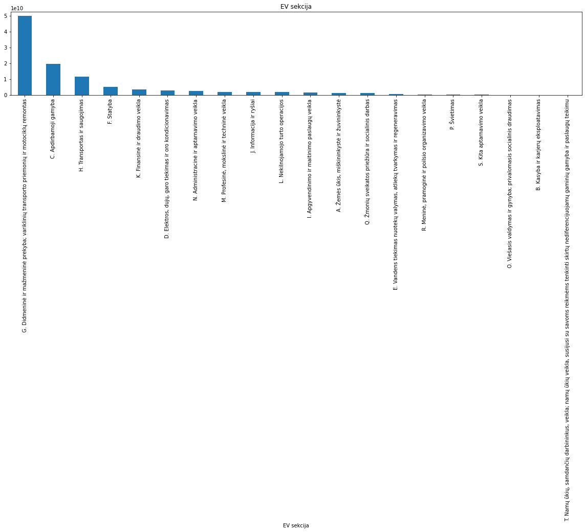


## Total Annual Revenue of Retail + Wholesale (category G) in 2019 - almost 50bn EUR


```python
"{:,.0f}".format( data_active.groupby('EV sekcija')['PVMD Apyvarta 2019m'].agg('sum').sort_values(ascending=False)[0] )
```


    '49,927,507,319'


### *Question*: (to someone who knows LT economy) - is this realistic?

## Lets look into VAT numbers


```python
cols = ['PVMD Apyvarta 2019m', 
        'PVM Prievolė 2019m', 
        'Mokėjimai 2019m']
```


```python
for col in cols:
    plt.hist(data_active[col], 100)
    plt.yscale('log')
    plt.xlabel(col)
    plt.show()
```

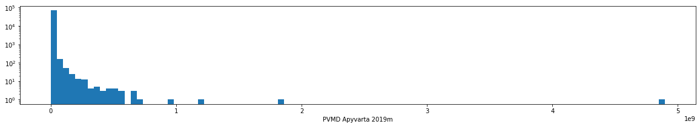


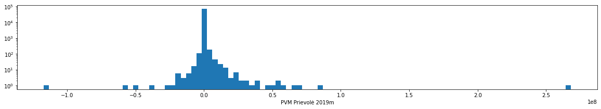


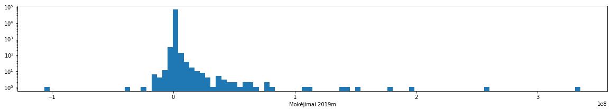


## Total Revenue (2019) - some of which is subject to VAT ~ 107Bn EUR


```python
"{:,.0f}".format( data_active['PVMD Apyvarta 2019m'].sum() )

```


    '107,761,074,956'


## Total VAT Obligation (2019) ~ 3.6Bn EUR or 3.35% of Revenue


```python
"{:,.0f}".format( data_active['PVM Prievolė 2019m'].sum() )
```


    '3,608,052,557'


```python
"{:,.2%}".format( data_active['PVM Prievolė 2019m'].sum() / data_active['PVMD Apyvarta 2019m'].sum() )
```


    '3.35%'


### *Question*: Does this - 3.6Bn EUR or 3.35% of Revenue - sound correct?

### *Question*: Does this mean that on average 16% of ALL REVENUE is what is considered VALUE ADDED; 
### which is then taxed at 21%; ( 16% * 21% = 3.35% ) ?

## Total VAT Payments (2019) ~ 8.6Bn EUR or 7.97% of Revenue


```python
"{:,.0f}".format( data_active['Mokėjimai 2019m'].sum() )
```


    '8,587,486,227'


```python
"{:,.2%}".format( data_active['Mokėjimai 2019m'].sum() / data_active['PVMD Apyvarta 2019m'].sum() )
```


    '7.97%'


### *Question*: Why do VAT payments exceed obligations more than twice?


```python
data_active['PVM Prievolė nuo PVMD Apyvarta 2019m'] = data_active['PVM Prievolė 2019m'] / data_active['PVMD Apyvarta 2019m']
data_active['PVM Mokėjimai nuo PVMD Apyvarta 2019m'] = data_active['Mokėjimai 2019m'] / data_active['PVMD Apyvarta 2019m']
data_active['PVM Mokėjimai nuo PVMD Prievolė 2019m'] = data_active['Mokėjimai 2019m'] / data_active['PVM Prievolė 2019m']
data_active = data_active.replace([np.inf, -np.inf], np.nan)
```


## Average VAT Obligation as share of Revenue 6%


```python
col = 'PVM Prievolė nuo PVMD Apyvarta 2019m'
plt.hist(data_active[data_active[col].between(-.3,.3)][col], 100)
#plt.yscale('log')
plt.xlabel(col)
plt.show()
data_active[data_active[col].between(-.3,.3)][col].median()
```


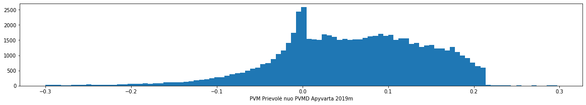


    0.06076872446481462


## Average VAT Obligation as share of Revenue by Sector


```python
data_active[data_active[col].between(-.3,.3)].groupby('EV sekcija')[col].agg('median').sort_values(ascending=False).plot.bar()
```


    <matplotlib.axes._subplots.AxesSubplot at 0x7f045d333bd0>


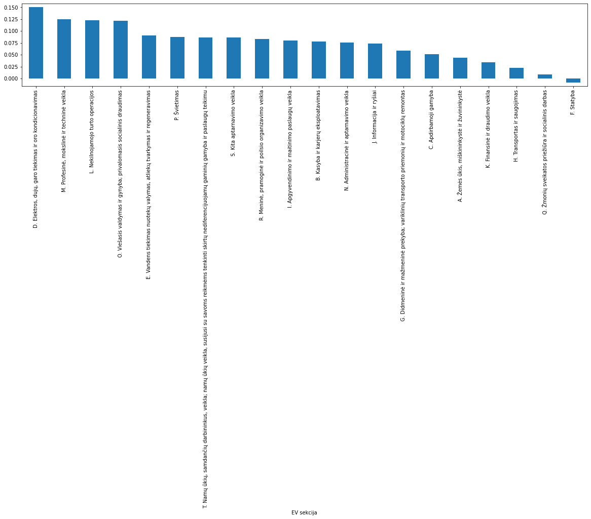


## Average VAT Payment as share of Revenue 10%


```python
col = 'PVM Mokėjimai nuo PVMD Apyvarta 2019m'
plt.hist(data_active[data_active[col].between(-.5,.5)][col], 100)
#plt.yscale('log')
plt.xlabel(col)
plt.show()
data_active[data_active[col].between(-.5,.5)][col].median()
```


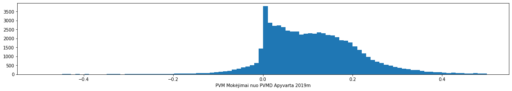


    0.10222917618930417


## Average VAT Payment as share of Revenue by Sector


```python
data_active[data_active[col].between(-.5,.5)].groupby('EV sekcija')[col].agg('median').sort_values(ascending=False).plot.bar()
```


    <matplotlib.axes._subplots.AxesSubplot at 0x7f0459452cd0>


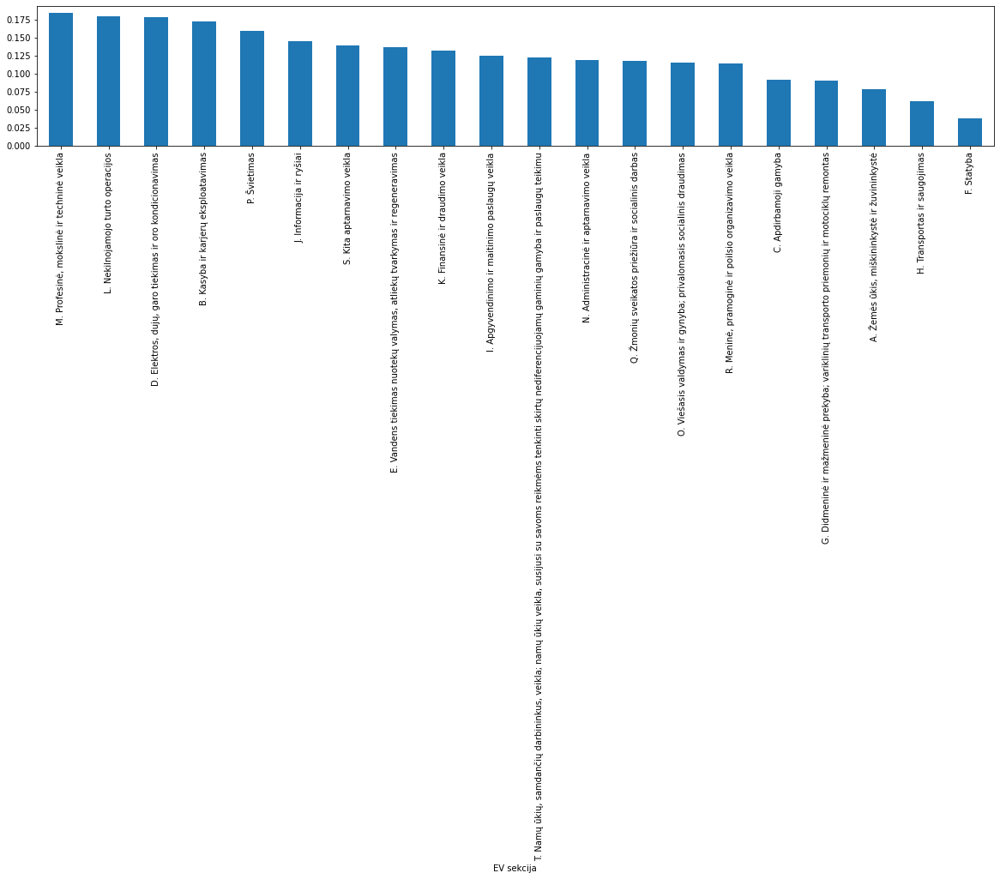


## Correlation between Salary Payments and VAT Payments ~48%


```python
data_active['Darbo apmokėjimo suma procentais nuo PVMD Apyvarta 2019m' ] = data_active['Darbo apmokėjimo suma 2019m'] / data_active['PVMD Apyvarta 2019m']
data_active = data_active.replace([np.inf, -np.inf], np.nan)
```


```python
data_active[
            (data_active['PVM Mokėjimai nuo PVMD Apyvarta 2019m'].between(-.5,.5)) &
            (data_active['Darbo apmokėjimo suma procentais nuo PVMD Apyvarta 2019m'].between(0,1))
        ][['Mokėjimai 2019m','Darbo apmokėjimo suma 2019m']].corr()
```


<div>
<style scoped>
    .dataframe tbody tr th:only-of-type {
        vertical-align: middle;
    }

    .dataframe tbody tr th {
        vertical-align: top;
    }

    .dataframe thead th {
        text-align: right;
    }
</style>
<table border="1" class="dataframe">
  <thead>
    <tr style="text-align: right;">
      <th></th>
      <th>Mokėjimai 2019m</th>
      <th>Darbo apmokėjimo suma 2019m</th>
    </tr>
  </thead>
  <tbody>
    <tr>
      <th>Mokėjimai 2019m</th>
      <td>1.000000</td>
      <td>0.483465</td>
    </tr>
    <tr>
      <th>Darbo apmokėjimo suma 2019m</th>
      <td>0.483465</td>
      <td>1.000000</td>
    </tr>
  </tbody>
</table>
</div>


## (High VAT) Services --> Retail --> Manufacturing --> Agriculture (Low VAT)


```python
data_active[data_active[col].between(-.5,.5)].groupby('EV skyrius')[col].agg('median').sort_values(ascending=False).plot.bar()
```


    <matplotlib.axes._subplots.AxesSubplot at 0x7f0459dfae90>


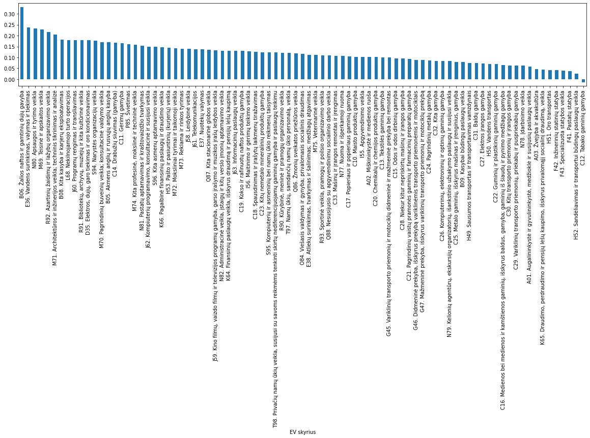


## Average VAT Payment is Equal to Average VAT Obligation


```python
col = 'PVM Mokėjimai nuo PVMD Prievolė 2019m'
plt.hist(data_active[data_active[col].between(-5,5)][col], 100)
#plt.yscale('log')
plt.xlabel(col)
plt.show()
data_active[data_active[col].between(-5,5)][col].mean()
```


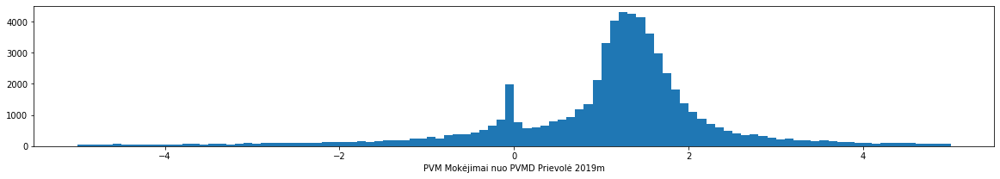


    1.0415817226848039


## Salaries & Employment


```python
cols = [
     'Darbuotojai 20200301',
     'Darbuotojai 20200401',
     'Darbo apmokėjimo suma 2019m']
```


```python
for col in cols:
    plt.hist(data_active[col], 100)
    plt.yscale('log')
    plt.xlabel(col)
    plt.show()
```


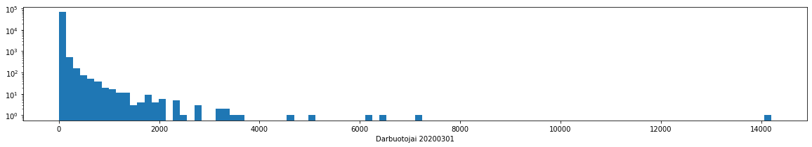


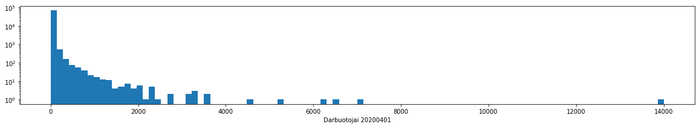


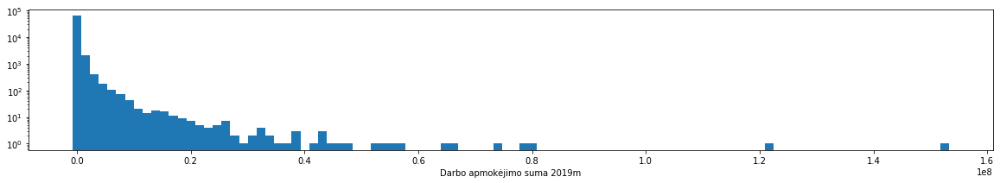


## Average number of employees is 15


```python
data_active['Darbuotojai 20200301'].mean()
```


    15.045411110318762


```python
data_active['Darbuotojai 20200301'].std()
```


    105.03360392925204


## 0.12% of companies (86) produce 18.25% of all revenue and employ 17% of all people


```python
data_active[data_active['Darbuotojai 20200301']>1000]['ID'].size
```


    86


```python
"{:,.2%}".format( 
    data_active[data_active['Darbuotojai 20200301']>1000]['ID'].size / data_active['ID'].size )
```


    '0.12%'


```python
"{:,.2%}".format( 
    data_active[data_active['Darbuotojai 20200301']>1000]['PVMD Apyvarta 2019m'].sum() / 
    data_active['PVMD Apyvarta 2019m'].sum()
    )
```


    '18.25%'


```python
"{:,.2%}".format( 
    data_active[data_active['Darbuotojai 20200301']>1000]['Darbuotojai 20200301'].sum() / 
    data_active['Darbuotojai 20200301'].sum()
    )
```


    '17.03%'


## 2% of companies (1447) produce 50% of all revenue and employ 50% of all people


```python
data_active[data_active['Darbuotojai 20200301']>100]['ID'].size
```


    1447


```python
"{:,.2%}".format( 
    data_active[data_active['Darbuotojai 20200301']>100]['ID'].size / data_active['ID'].size )
```


    '2.00%'


```python
"{:,.2%}".format( 
    data_active[data_active['Darbuotojai 20200301']>100]['PVMD Apyvarta 2019m'].sum() / 
    data_active['PVMD Apyvarta 2019m'].sum()
    )
```


    '51.51%'


```python
"{:,.2%}".format( 
    data_active[data_active['Darbuotojai 20200301']>100]['Darbuotojai 20200301'].sum() / 
    data_active['Darbuotojai 20200301'].sum()
    )
```


    '48.94%'


## ... they also pay 55% of all the salaries


```python
"{:,.2%}".format( 
    data_active[data_active['Darbuotojai 20200301']>100]['Darbo apmokėjimo suma 2019m'].sum() / 
    data_active['Darbo apmokėjimo suma 2019m'].sum()
    )
```


    '54.61%'


## ... they pay 56% of all the VAT


```python
"{:,.2%}".format( 
    data_active[data_active['Darbuotojai 20200301']>100]['Mokėjimai 2019m'].sum() / 
    data_active['Mokėjimai 2019m'].sum()
    )
```


    '55.61%'


## Top 4 sectors make up 80% of all revenue


```python
(data_active.groupby(['EV sekcija'])['PVMD Apyvarta 2019m'].agg('sum') / data_active['PVMD Apyvarta 2019m'].sum()).sort_values(ascending=False)[0:4].sum()
```


    0.8015616909377408


```python
(data_active.groupby(['EV sekcija'])['PVMD Apyvarta 2019m'].agg('sum') / data_active['PVMD Apyvarta 2019m'].sum()).sort_values(ascending=False).plot.bar()
```


    <matplotlib.axes._subplots.AxesSubplot at 0x7f045c41aed0>


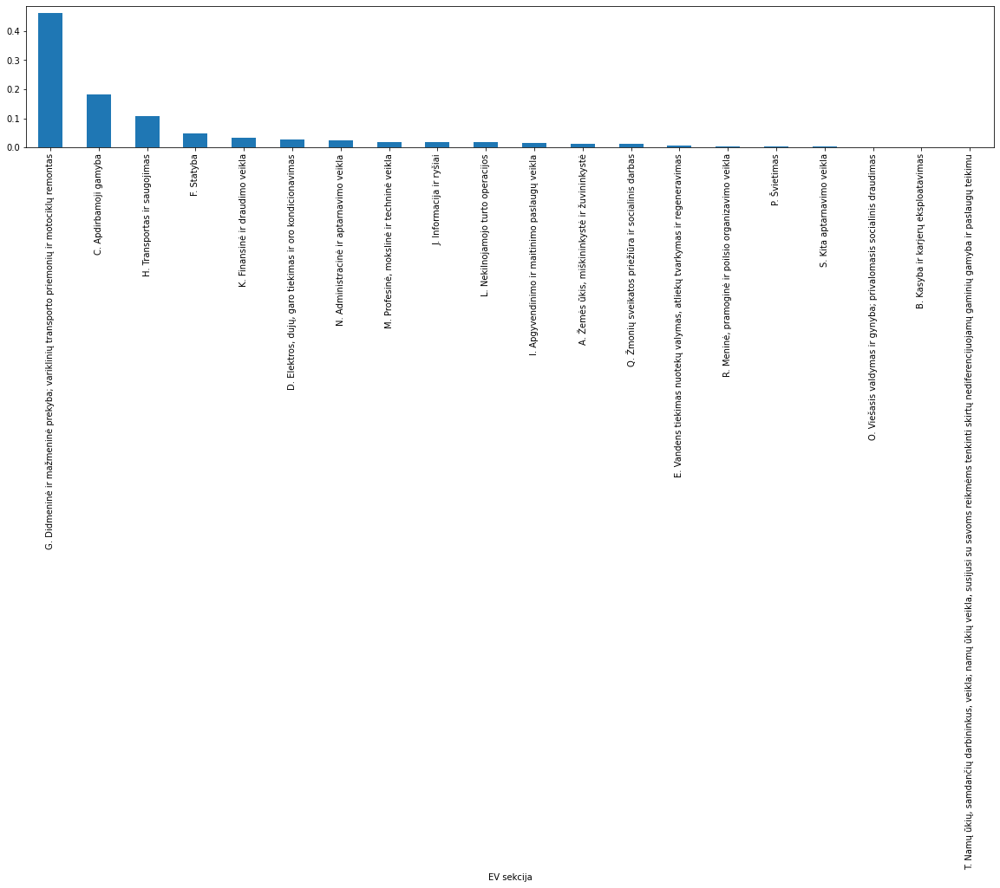


## Top 4 sectors employ 65% of all people


```python
(data_active.groupby(['EV sekcija'])['Darbuotojai 20200301'].agg('sum') / data_active['Darbuotojai 20200301'].sum()).sort_values(ascending=False)[0:4].sum()
```


    0.6477914208713736


```python
(data_active.groupby(['EV sekcija'])['Darbuotojai 20200301'].agg('sum') / data_active['Darbuotojai 20200301'].sum()).sort_values(ascending=False).plot.bar()
```


    <matplotlib.axes._subplots.AxesSubplot at 0x7f0459cf9750>


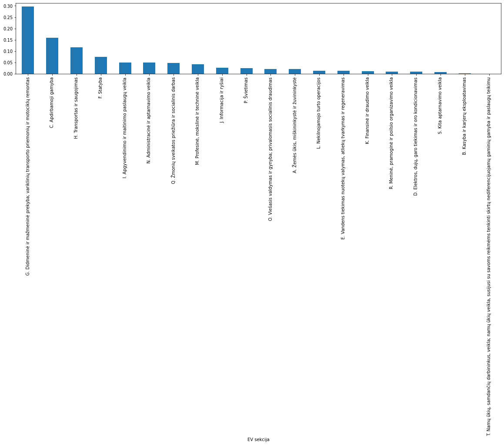


### *Question*: Why do some salaries have negative values? Data error?


```python
plt.hist(data_active[data_active['Darbo apmokėjimo suma 2019m']<0]['Darbo apmokėjimo suma 2019m'], 100)
plt.xlabel('Darbo apmokėjimo suma 2019m - Neigiamos reiksmes')
plt.show()
```


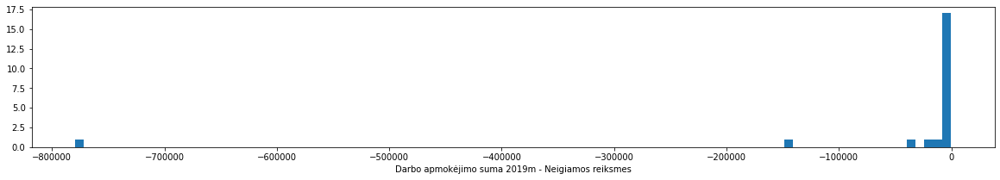


```python
plt.hist(
    data_active[
            (~data_active['Darbo apmokėjimo suma procentais nuo PVMD Apyvarta 2019m'].isnull()) &  
            (data_active['Darbo apmokėjimo suma procentais nuo PVMD Apyvarta 2019m']>0) &
            (data_active['Darbo apmokėjimo suma procentais nuo PVMD Apyvarta 2019m']<2)
            ]['Darbo apmokėjimo suma procentais nuo PVMD Apyvarta 2019m'], 100)
#plt.yscale('log')
plt.xlabel('Darbo apmokėjimo suma procentais nuo PVMD Apyvarta 2019m')
plt.show()

```


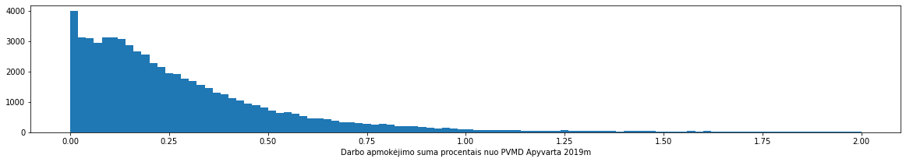


```python
data_active[
            (~data_active['Darbo apmokėjimo suma procentais nuo PVMD Apyvarta 2019m'].isnull()) &  
            (data_active['Darbo apmokėjimo suma procentais nuo PVMD Apyvarta 2019m']>1) 
            ]['ID'].size
```


    3527


```python
"{:,.2%}".format( 
    data_active[
            (~data_active['Darbo apmokėjimo suma procentais nuo PVMD Apyvarta 2019m'].isnull()) &  
            (data_active['Darbo apmokėjimo suma procentais nuo PVMD Apyvarta 2019m']>1) 
            ]['ID'].size / 
    data_active['ID'].size )
```


    '4.89%'


## 3527 (or 5%) of companies' salary payments exceed their revenues (surely not a good sign)


```python
data_active[
            (~data_active['Darbo apmokėjimo suma procentais nuo PVMD Apyvarta 2019m'].isnull()) &  
            (data_active['Darbo apmokėjimo suma procentais nuo PVMD Apyvarta 2019m']>0.5) 
            ]['ID'].size
```


    11808


```python
"{:,.2%}".format( 
    data_active[
            (~data_active['Darbo apmokėjimo suma procentais nuo PVMD Apyvarta 2019m'].isnull()) &  
            (data_active['Darbo apmokėjimo suma procentais nuo PVMD Apyvarta 2019m']>0.5) 
            ]['ID'].size / 
    data_active['ID'].size )
```


    '16.36%'


## 11808 (or 16%) of companies' salary payments make up at least half of their revenues

## Average salary


```python
data_active['Vidutinis darbuotojo uzmokestis 2019m'] = data_active['Darbo apmokėjimo suma 2019m'] / data_active['Darbuotojai 20200301']
data_active = data_active.replace([np.inf, -np.inf], np.nan)
```


```python
data_active['Vidutinis darbuotojo uzmokestis 2019m'].mean()
```


    9346.123791207547


### Average annual salary is 9346 EUR


```python

plt.hist(
        data_active[data_active['Vidutinis darbuotojo uzmokestis 2019m']>0 ]['Vidutinis darbuotojo uzmokestis 2019m'], 
        500
    )
#plt.yscale('log')
plt.xlabel('Darbo apmokėjimo suma procentais nuo PVMD Apyvarta 2019m')
plt.xlim(0,50000)
plt.show()

```


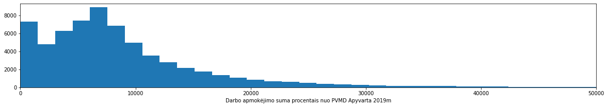


### *Question*: Why is there a peak at around 1500EUR?

### Maximum salary is 756'000EUR (does not sound right)


```python
data_active['Vidutinis darbuotojo uzmokestis 2019m'].max()
```


    756447.0


## Average Salaries By Industry


```python
vidutinis_uzmokestis_EV_sekcija_daugiau_nei_5_darbuotojai = pd.DataFrame(data_active[data_active['Darbuotojai 20200301']>5].groupby('EV sekcija')['Vidutinis darbuotojo uzmokestis 2019m'].mean().sort_values(ascending=False)) 
```


```python
vidutinis_uzmokestis_EV_sekcija_daugiau_nei_5_darbuotojai
```


<div>
<style scoped>
    .dataframe tbody tr th:only-of-type {
        vertical-align: middle;
    }

    .dataframe tbody tr th {
        vertical-align: top;
    }

    .dataframe thead th {
        text-align: right;
    }
</style>
<table border="1" class="dataframe">
  <thead>
    <tr style="text-align: right;">
      <th></th>
      <th>Vidutinis darbuotojo uzmokestis 2019m</th>
    </tr>
    <tr>
      <th>EV sekcija</th>
      <th></th>
    </tr>
  </thead>
  <tbody>
    <tr>
      <th>K. Finansinė ir draudimo veikla</th>
      <td>25406.547218</td>
    </tr>
    <tr>
      <th>J. Informacija ir ryšiai</th>
      <td>22040.658276</td>
    </tr>
    <tr>
      <th>O. Viešasis valdymas ir gynyba; privalomasis socialinis draudimas</th>
      <td>18772.377446</td>
    </tr>
    <tr>
      <th>D. Elektros, dujų, garo tiekimas ir oro kondicionavimas</th>
      <td>16289.984792</td>
    </tr>
    <tr>
      <th>M. Profesinė, mokslinė ir techninė veikla</th>
      <td>15923.648566</td>
    </tr>
    <tr>
      <th>B. Kasyba ir karjerų eksploatavimas</th>
      <td>14807.112188</td>
    </tr>
    <tr>
      <th>L. Nekilnojamojo turto operacijos</th>
      <td>13785.751486</td>
    </tr>
    <tr>
      <th>E. Vandens tiekimas nuotekų valymas, atliekų tvarkymas ir regeneravimas</th>
      <td>12558.982243</td>
    </tr>
    <tr>
      <th>Q. Žmonių sveikatos priežiūra ir socialinis darbas</th>
      <td>12431.295276</td>
    </tr>
    <tr>
      <th>G. Didmeninė ir mažmeninė prekyba; variklinių transporto priemonių ir motociklų remontas</th>
      <td>12148.674182</td>
    </tr>
    <tr>
      <th>C. Apdirbamoji gamyba</th>
      <td>11999.262925</td>
    </tr>
    <tr>
      <th>N. Administracinė ir aptarnavimo veikla</th>
      <td>11669.178471</td>
    </tr>
    <tr>
      <th>P. Švietimas</th>
      <td>11667.494246</td>
    </tr>
    <tr>
      <th>A. Žemės ūkis, miškininkystė ir žuvininkystė</th>
      <td>10931.187827</td>
    </tr>
    <tr>
      <th>R. Meninė, pramoginė ir poilsio organizavimo veikla</th>
      <td>10343.798443</td>
    </tr>
    <tr>
      <th>H. Transportas ir saugojimas</th>
      <td>10330.282536</td>
    </tr>
    <tr>
      <th>F. Statyba</th>
      <td>10179.600028</td>
    </tr>
    <tr>
      <th>S. Kita aptarnavimo veikla</th>
      <td>9828.052592</td>
    </tr>
    <tr>
      <th>I. Apgyvendinimo ir maitinimo paslaugų veikla</th>
      <td>7706.252175</td>
    </tr>
    <tr>
      <th>T. Namų ūkių, samdančių darbininkus, veikla; namų ūkių veikla, susijusi su savoms reikmėms tenkinti skirtų nediferencijuojamų gaminių gamyba ir paslaugų teikimu</th>
      <td>3209.055556</td>
    </tr>
  </tbody>
</table>
</div>


```python
g = sns.lmplot(
    x='Darbuotojai 20200301', 
    y='Vidutinis darbuotojo uzmokestis 2019m',
    col='EV sekcija',
    data=data_active[data_active['Darbuotojai 20200301']>5],
    fit_reg=True,
    col_wrap=3, 
    height=6      
    ).set_axis_labels("Darbuotoju skaicius", "Vidutinis uzmokestis").set(xlim=(10, 1000), ylim=(500, 70000)).fig.subplots_adjust(wspace=1)
```


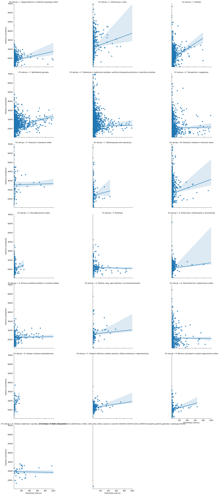


```python

```


```python

```
